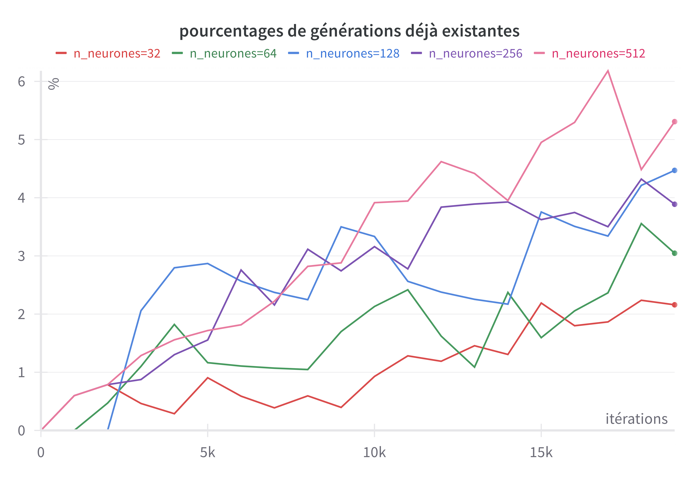
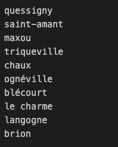
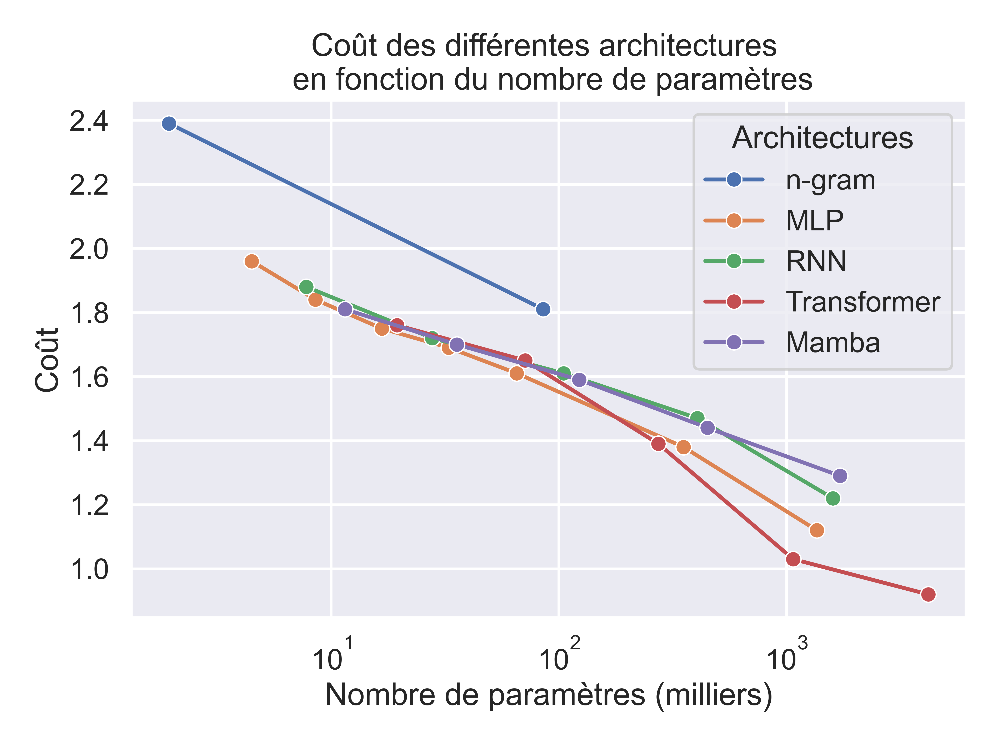
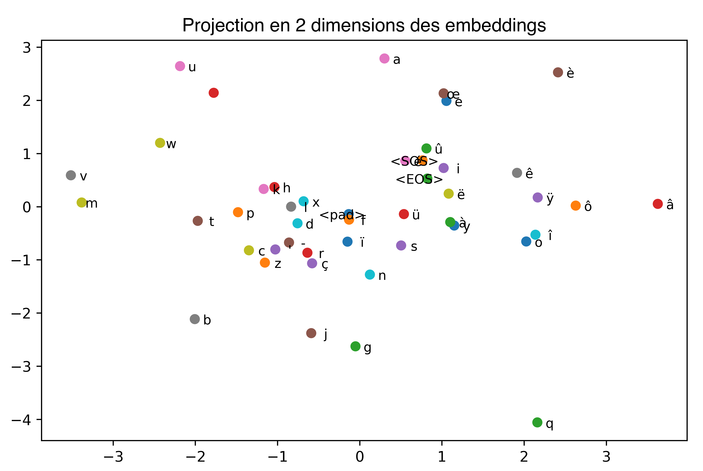

# Générer des noms de villes et communes françaises

Etant donnée les plus de 36000 communes françaises, peut-on entraîner une IA à générer de nouveaux noms de communes ?

    

La réponse est oui, et ce repo le fait pas à pas, avec des modèles de plus en plus puissants et poussés :

- <b>niveau 0</b> : ôeï'yêçsmpysâjâ, rt' eoéae-fëâc

- <b>niveau 1</b> : lulicutgnnc, vblpaleis

- <b>niveau 2</b> : javaserg-me-mant, éjouchâteugone

- <b>niveau 3</b> : saint-mellesnince, brémont, la saingerres

- <b>niveau 4</b> : saint-andoux-le-creix, gragille, chaymont-en-calès

Les modèles les plus puissants utilisent des réseaux de neurones. Ce repo propose aussi d'interpréter les réseaux de neurones une fois ceux-ci entraînés : cela nous permet d'analyser <b>ce qui se passe dans le réseau</b> lorsqu'il produit un nom de commune.
C'est ainsi qu'on peut découvrir des <b>concepts</b> calculés par les réseaux. Par exemple, le concept qui s'active après l'apparition de "saint" :

    

On peut jouer manuellement avec ces concepts et infuencer le réseau.

## Génération de noms de communes
Ce repo utilise 3 modèles différents pour générer des noms de communes :
- le n-gram, qui calcul une table de transitions sur l'ensemble des données et génère des noms en échantillonnant cette table de transitions. Par exemple, pour n=2, on obtient le bigram : on construit une table de probabilités où la probabilité du couple (a, b) correspond à la probabilité d'avoir b étant donné a dans l'ensemble des données d'entraînement (les 36000 noms de communes). On généralise ça à n. Cela est implémenté dans le fichier `1_n_grams.ipynb`.

- le réseau de neurones : le réseau prend en entrée le contexte de lettres (de taille fixée) et donne en sortie la lettre qui suit. On utilise un "embedding" pour chaque lettre, ce qui procure une certaine capacité de généralisation au réseau lorsqu'il apprend.
Par exemple, si les embeddings des mots "chien" et "chat" sont similaires, alors, quand le réseau va s'entraîner sur la phrase "le chien court", il saura que la phrase "le chat court" est aussi possible (dans ce repo on ne travaille pas avec des mots mais des lettres). Cela est implémenté dans le fichier `2_mlp.ipynb` (`2_mlp.py` dans sa version script Python).

- le réseau de neurones récurrent (ou RNN pour Recurrent Neural Network). Voir [ma vidéo](https://www.youtube.com/watch?v=lYGoH7pU3J4) à ce sujet.
Cela est implémenté dans le fichier `3_rnn.ipynb` (`3_rnn.py` dans sa version script Python).

- le Transformer : l'outil SOTA actuel pour manipuler des séquences.
Cela est implémenté dans le fichier `3_transformer.ipynb`.
 
## Choix des hyperparamètres
Cette partie s'intéresse à la taille des réseaux qu'on entraîne.
Quel est le choix optimal de la taille du réseau à entraîner ?

Voyons tout d'abord ce qui se passe avec les réseaux de neurones simples (MLP).

Sans surprise, augmenter le nombre de neurones permet de mieux coller aux données d'entraînement, ie on obtient un coût plus bas :

    

<i>Ici, on a fixé n_context=10, d_model = 8. C'est donc le paramètre d_hidden qui change, le nombre de neurones dans la couche cachée.</i>

 

Alors, on prend le plus grand réseau ?  
Attention au sur-apprentissage !

Voici le même graphique, mais avec le coût de validation superposé :

    

<i>Les coûts d'entraînement sont en trait plein, les coûts de validation en pointillés Les couleurs correspondent toujours à la taille des modèles.</i>

 

C'est un peu encombré, mais on remarque que :
- pour les réseaux petits (`n_neurones=32` et `64`), les coûts d'entraînement et de validation se superposent : pas de problème.
- à partir de là, plus on augmente la taille du réseau et plus on va vers la droite, plus l'écart se creuse entre les deux coûts.

Donc si on prend un réseau trop puissant, qu'on entraîne trop longtemps, on passe en <b>sur-apprentissage</b> : le réseau est trop "puissant" et commence à retenir les données. Cela est aussi dû aux données qui sont en nombre assez restreint (36 000 ce n'est pas beaucoup comparée aux échelles habituelles).

Et ce sur-apprentissage, il se traduit directement par des générations de noms de communes qui existent déjà :

    

<i>Evolution du pourcentage des générations qui existent déjà au cours de l'entraînement.</i>

 
Voici quelques générations de noms de communes qui existent déjà :

    

Le modèle est trop puissant et donc à commencé à retenir les données d'entraînement, sacrifiant ainsi sa capacité à généraliser sur les données de validation.

Les mêmes graphes sont disponibles avec les modèles plus évolués (RNN, Transformer et Mamba). La conclusion est la même donc je ne les ai pas inclus ici.

## Choix de l'architecture
Mais alors, quelle architecture choisir ? Quelle est la meilleure ?

 

Voici les résultats obtenus par les différentes architectures lorsqu'on augmente leur nombre de paramètres :

    

On le voit, les réseaux de neurones classiques (MLP) restent quand même assez compétitifs avec les modèles plus avancés jusqu'à un certain nombre de paramètres.
Mamba et RNN sont à peu près au niveau des MLP. Le Transformer, lui, est le meilleur ici.

<i>Ce graphique est à titre informatif, et s'applique seulement sur ce problème. Attention à ne pas en tirer de conclusions trop générales (par exemple, on utilise les mêmes hyperparamètres pour tous les modèles, peut-être que Mamba aurait profité de meilleurs hyperparamètres et que c'est pour ça qu'il est moins performant ?)</i>

## L'utilité du plongement/embedding

La première opération que l'on fait avec les modèles à base de réseaux de neurones (MLP, RNN, Transformer et Mamba) c'est le plongement de lettre, aussi connu par embedding.

Cette opération permet de passer d'une lettre, encodée sous forme de <b>token</b>, c'est-à-dire un index (par exemple, pour a c'est `0` et pour g c'est `12`), à un <b>vecteur</b>, qu'on appelle l'embedding.

L'espace dans lequel on "plonge" les lettres est intéressant à analyser. En voici une reconstitution en 2 dimensions :

    

<i>Embeddings des lettres, visualisé en 2D (orignalement en 8D)</i>

On le voit, les lettres qu'on pense être similaires sont en effet représentées par des embeddings proches. Par exemple, la a, le e et le o-e entrelacé. Juste en dessous, on retrouve les voyelles un peu plus spéciales (ÿ, ë, î...) et sur la gauche les consonnes.

C'est ce même espace qui est à l'origine du fameux exemple embedding(roi) - embedding(homme) + embedding(femme) = embedding(reine). Sauf qu'au lieu d'encoder des lettres, cet exemple se base sur des embeddings de mots. Il y a donc, dans cet espace, des directions qui ont un certain sens réel (ici, la directions royauté et genre). On peut ainsi "jouer" avec ces directions et obtenir des résultats consistants.

## Interpréter les réseaux entraînés

Voir [ma vidéo](https://www.youtube.com/watch?v=n4EnafoZ38Q) sur l'interprétation des concepts dans un réseau de neurones.

L'idée générale est de pouvoir extraire et analyser les concepts représentés par le réseau. Ces concepts correspondent à des concepts réels liés aux données. Par exemple, dans les modèles de langage géants, on peut trouver un concept relié à la Tour Eiffel. Dans nos réseaux à petite échelle, on retrouve aussi ces concepts. 

### Entraînement du SAE
Pour extraire les concepts représentés par le réseau (on n'étudie que le Transformer ici), on utilise un Sparse Auto Encoder, ou SAE. Ce réseau de neurones va analyser les activations du premier réseau de neurones (le Transformer, qui génère les noms de communes) et détecter des directions, qui sont associées à des concepts.

Tout se passe dans le fichier `5_sae.ipynb`

Les fichiers `simple_sae.ipynb` et `simple_sae_topk.ipynb` ont pour but d'entraîner des SAEs sur des données test en 2 dimensions, avec peu de directions à trouver. C'est essentiellement visuel pour comprendre ce que fait le SAE.

### Recherche de concepts

Une fois le SAE entraîné et sauvegardé, on peut analyser les concepts trouvés. C'est ce qui est fait dans le fichier `6_explore.ipynb`. A noter que ce fichier propose aussi l'analyse des neurones individuels (donc sans la nécessité du SAE).

On remarque les concepts permettent d'atteindre une meilleure monosémie que les neurones (c'est tout le but).

### Manipulation de concepts

Une fois les concepts identifiés, on peut vouloir les modifier au moment de l'inférence et voir comment cela impacte le réseau. C'est ce que propose le fichier `7_steering.ipynb`

### Concepts influents

On pourrait aussi, étant donné une sortie prédite par le réseau, voir quels sont les concepts qui ont le plus influé sur la production de cette sortie particulière. Cela n'est pas encore implémenté ici (les PR sont les bienvenus!).