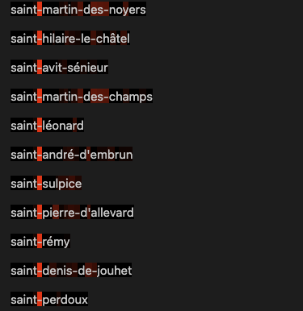

# Générer des noms de villes et communes françaises

Etant donnée les plus de 36000 communes françaises, peut-on entraîner une IA à générer de nouveaux noms de communes ?

    

La réponse est oui, et ce repo le fait pas à pas, avec des modèles de plus en plus puissants et poussés :

- <b>niveau 0</b> : ôeï'yêçsmpysâjâ, rt' eoéae-fëâc

- <b>niveau 1</b> : lulicutgnnc, vblpaleis

- <b>niveau 2</b> : javaserg-me-mant, éjouchâteugone

- <b>niveau 3</b> : saint-mellesnince, brémont, la saingerres

- <b>niveau 4</b> : saint-andoux-le-creix, gragille, chaymont-en-calès

Les modèles les plus puissants utilisent des réseaux de neurones. Ce repo propose aussi d'interpréter les réseaux de neurones une fois ceux-ci entraînés : cela nous permet d'analyser <b>ce qui se passe dans le réseau</b> lorsqu'il produit un nom de commune.
C'est ainsi qu'on peut découvrir des <b>concepts</b> calculés par les réseaux. Par exemple, le concept qui s'active après l'apparition de "saint" :

    

On peut jouer manuellement avec ces concepts et infuencer le réseau.

## Génération de noms de communes
Ce repo utilise 3 modèles différents pour générer des noms de communes :
- le n-gram, qui calcul une table de transitions sur l'ensemble des données et génère des noms en échantillonnant cette table de transitions. Par exemple, pour n=2, on obtient le bigram : on construit une table de probabilités où la probabilité du couple (a, b) correspond à la probabilité d'avoir b étant donné a dans l'ensemble des données d'entraînement (les 36000 noms de communes). On généralise ça à n. Cela est implémenté dans le fichier `1_n_grams.ipynb`.

- le réseau de neurones : le réseau prend en entrée le contexte de lettres (de taille fixée) et donne en sortie la lettre qui suit. On utilise un "embedding" pour chaque lettre, ce qui procure une certaine capacité de généralisation au réseau lorsqu'il apprend.
Par exemple, si les embeddings des mots "chien" et "chat" sont similaires, alors, quand le réseau va s'entraîner sur la phrase "le chien court", il saura que la phrase "le chat court" est aussi possible (dans ce repo on ne travaille pas avec des mots mais des lettres). Cela est implémenté dans le fichier `2_mlp.ipynb`.

- le Transformer : l'outil SOTA actuel pour manipuler des séquences.
Cela est implémenté dans le fichier `3_transformer.ipynb`.
 

## Interpréter les réseaux entraînés

Voir [ma vidéo](https://www.apple.com) sur l'interprétation des concepts dans un réseau de neurones.

L'idée générale est de pouvoir extraire et analyser les concepts représentés par le réseau. Ces concepts correspondent à des concepts réels liés aux données. Par exemple, dans les modèles de langage géants, on peut trouver un concept relié à la Tour Eiffel. Dans nos réseaux à petite échelle, on retrouve aussi ces concepts. 

### Entraînement du SAE
Pour extraire les concepts représentés par le réseau (on n'étudie que le Transformer ici), on utilise un Sparse Auto Encoder, ou SAE. Ce réseau de neurones va analyser les activations du premier réseau de neurones (le Transformer, qui génère les noms de communes) et détecter des directions, qui sont associées à des concepts.

Tout se passe dans le fichier `4_sae.ipynb`

Les fichiers `simple_sae.ipynb` et `simple_sae_topk.ipynb` ont pour but d'entraîner des SAEs sur des données test en 2 dimensions, avec peu de directions à trouver. C'est essentiellement visuel pour comprendre ce que fait le SAE.

### Recherche de concepts

Une fois le SAE entraîné et sauvegardé, on peut analyser les concepts trouvés. C'est ce qui est fait dans le fichier `5_explore.ipynb`. A noter que ce fichier propose aussi l'analyse des neurones individuels (donc sans la nécessité du SAE).

On remarque les concepts permettent d'atteindre une meilleure monosémie que les neurones (c'est tout le but).

### Manipulation de concepts

Une fois les concepts identifiés, on peut vouloir les modifier au moment de l'inférence et voir comment cela impacte le réseau. C'est ce que propose le fichier `6_steering.ipynb`

### Concepts influents

On pourrait aussi, étant donné une sortie prédite par le réseau, voir quels sont les concepts qui ont le plus influé sur la production de cette sortie particulière. Cela n'est pas encore implémenté ici (les PR sont les bienvenues!).