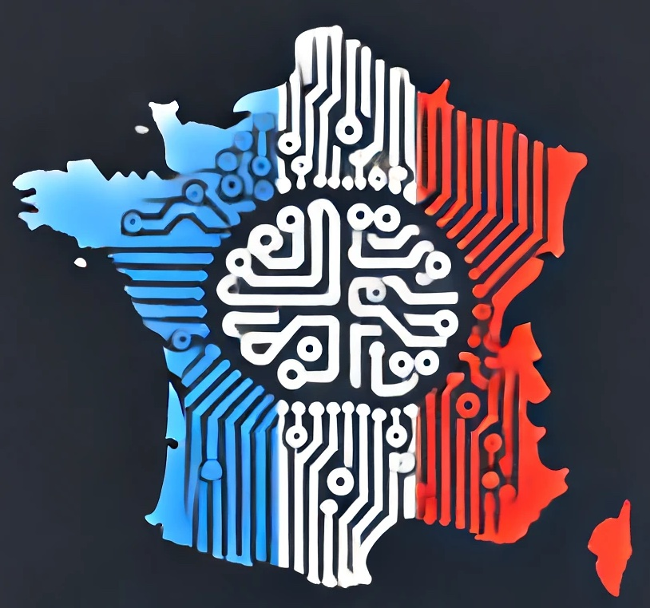

# Générer des noms de villes et communes françaises

Etant donnée les plus de 36000 communes françaises, peut-on entraîner une IA à générer de nouveaux noms de communes ?

  

La réponse est oui, et ce repo le fait pas à pas, avec des modèles de plus en plus puissants et poussés :

- <b>niveau 0</b> : ôeï'yêçsmpysâjâ, rt' eoéae-fëâc

- <b>niveau 1</b> : lulicutgnnc, vblpaleis

- <b>niveau 2</b> : javaserg-me-mant, éjouchâteugone

- <b>niveau 3</b> : saint-mellesnince, brémont, la saingerres

- <b>niveau 4</b> : saint-andoux-le-creix, gragille, chaymont-en-calès

Les modèles les plus puissants utilisent des réseaux de neurones. Ce repo propose aussi d'interpréter les réseaux de neurones une fois ceux-ci entraînés : cela nous permet d'analyser <b>ce qui se passe dans le réseau</b> lorsqu'il produit un nom de commune.
C'est ainsi qu'on peut découvrir des <b>concepts</b> calculés par les réseaux. Par exemple, le concept qui s'active après l'apparition de "saint" :

[image concept activations saint]

On peut joueur manuellement avec ces concepts et infuencer le réseau.

## Génération de noms de communes

## Interpréter les réseaux entraînés

#### Recherche de concepts
#### Manipulation de concepts
#### Concepts influents